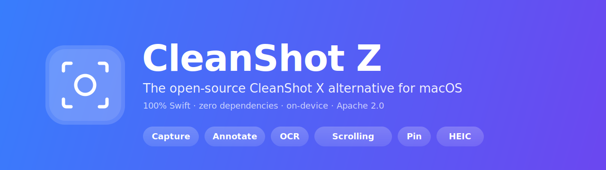

<p align="center">
  
</p>

<h1 align="center">CleanShot Z</h1>

<p align="center"><b>The open-source CleanShot X alternative for macOS.</b><br>
Capture, annotate, OCR, and organize screenshots from your menu bar —<br>
100% Swift, zero dependencies, everything on-device.</p>

<p align="center">
  
  
  
  
</p>

<p align="center">
  <a href="#features">Features</a> ·
  <a href="#why-cleanshot-z">Why CleanShot Z</a> ·
  <a href="#install--build">Install</a> ·
  <a href="#usage">Usage</a> ·
  <a href="#architecture">Architecture</a> ·
  <a href="#faq">FAQ</a>
</p>

Built entirely on Apple's frameworks — **ScreenCaptureKit** for capture,
**VisionKit (Live Text)** for OCR, SwiftUI + AppKit for UI. No Electron, no
analytics, no account, no network calls. Builds offline with just the Command
Line Tools.

---

## Features

| | |
| --- | --- |
| 🎯&nbsp;**All-in-One capture** | Select a region, adjust with 8 handles + **magnetic snapping** to window edges, then pick Capture / Scroll / OCR from a floating tool menu (⌘⇧1). |
| 🖼&nbsp;**Area / Window / Fullscreen** | Drag a region or click a hover-highlighted window (⌘⇧4); fullscreen on the display under your cursor (⌘⇧3). Multi-display & mixed-DPI correct. |
| 📜&nbsp;**Scrolling capture** | Scroll through long pages, chats, or code — frames are stitched live into one tall image. No Accessibility permission needed. |
| ✏️&nbsp;**Layer-based editor** | Arrows, shapes, pencil, highlighter, text, counter badges, blur/pixelate redaction, crop. Every annotation stays selectable, movable, resizable — full undo/redo, one-key tool shortcuts. |
| 🎨&nbsp;**Background tool** | Gradient backdrop + padding + rounded corners + drop shadow for social-ready screenshots. |
| 🔤&nbsp;**Copy Text (OCR)** | Apple's **Live Text** engine on-device (⌘⇧2) — excellent Vietnamese + English, straight to clipboard with line breaks intact. |
| 📌&nbsp;**Pin screenshots** | Float any capture always-on-top; drag anywhere, resize keeps aspect. |
| 🗂&nbsp;**History** | 30-day rolling capture history with a thumbnail browser. |
| 💾&nbsp;**Smart output** | PNG / JPEG / **HEIC (~8× smaller than PNG)** with quality slider, optional Retina→1x downscale. |
| 📁&nbsp;**`.cleanshotz` projects** | A .psd for screenshots: base image + all annotation layers in one file. Double-click in Finder to resume editing, export to any format. |
| ⚡&nbsp;**Quick Access cards** | Compact floating thumbnails after each shot — hover for Copy/Edit, right-click for Close All, auto-hide on a timer. |
| ⚙️&nbsp;**Configurable** | Remappable global hotkeys (click-to-record), launch at login, save folder, filename prefix, self-timer capture. |

## Why CleanShot Z?

**One small native app, no strings attached**: the capture + annotate + OCR
workflow of paid tools, free and Apache-2.0, with nothing leaving your Mac.

- **Genuinely native and tiny.** Swift + SwiftUI on Apple frameworks only. No
  Electron shell, no bundled runtimes, zero external Swift packages — the whole
  codebase is auditable in one sitting and builds offline with just the
  Command Line Tools (no Xcode).
- **Private by design.** Zero network calls, zero telemetry, no account, no
  cloud requirement. OCR runs on-device via Apple's Live Text engine — the
  same one Preview and Photos use.
- **Annotations that stay editable.** Most tools flatten your arrows the moment
  you draw them. CleanShot Z keeps every annotation as a layer — during the
  session *and* across sessions via `.cleanshotz` project files.
- **Small files by default.** HEIC output is ~8× smaller than PNG at visually
  identical quality; optional Retina→1x downscale quarters pixels again. A
  screenshot that used to be 2 MB can be tens of KB.
- **UX modeled on the best.** Selection overlay, editor toolbar, Quick Access
  flow, and micro-behaviors (Shift-constrain, snapping, arrow-key nudge,
  hover cursors) follow the CleanShot X patterns users already know.

### Comparison <sub>(macOS screenshot tools · mid-2026)</sub>

|                          | **CleanShot Z** | CleanShot X | Shottr | Snagit | macOS built-in |
| ------------------------ | :-------------: | :---------: | :----: | :----: | :------------: |
| 💵 Price                 | **free, Apache 2.0** | $29 + subscription for cloud | donationware | $39/yr | free |
| 🔓 Open source           |       ✅        |     ❌      |   ❌   |   ❌   |       ❌       |
| ✏️ Layer-based re-editable annotations | ✅ + project file | ✅ (.cleanshot) | partial | ✅ | ❌ |
| 📜 Scrolling capture     |       ✅        |     ✅      |   ✅   |   ✅   |       ❌       |
| 🔤 OCR (incl. Vietnamese)|   ✅ Live Text  |     ✅      |   ✅   |   ✅   |  select-only   |
| 💾 HEIC small-file output|       ✅        |     ❌      |   ❌   |   ❌   |       ❌       |
| 🎥 Screen recording      |  📝 planned     |     ✅      |   ❌   |   ✅   |       ✅       |
| ☁️ Required account/cloud|     none        |  optional   |  none  | TechSmith | none        |
| 🕵️ Telemetry             |    **zero**     |    some     |  some  |  yes   |      n/a       |

*Honest caveats*: CleanShot Z is young — screen recording/GIF, trackpad
signatures, and S3 backup are [specced](docs/) but not built yet; the app isn't
notarized (build from source); and it's tuned for the common paths, not every
edge case. If you need video capture today or a vendor SLA, the incumbents are
the safer pick.

## Requirements

- macOS **14 (Sonoma) or later** — Apple Silicon & Intel
- Command Line Tools (to build from source; **full Xcode not needed**)
- First launch: grant **Screen Recording** in System Settings → Privacy &
  Security, then relaunch
- To use ⌘⇧3/⌘⇧4: free them from macOS in System Settings → Keyboard →
  Keyboard Shortcuts → Screenshots (same onboarding as CleanShot X)

## Install / Build

```bash
git clone https://github.com/nextage-soft/clean-shot-z.git
cd clean-shot-z
./scripts/install-to-applications.sh   # build → sign → /Applications → launch
```

Or just build the bundle without installing:

```bash
./scripts/build-and-bundle-app.sh      # → "build/CleanShot Z.app"
open "build/CleanShot Z.app"
```

The script signs with your **Apple Development** certificate when one exists
(stable identity — macOS remembers the Screen Recording grant across rebuilds)
and falls back to ad-hoc. It also pins a compatible macOS SDK automatically
when the newest Command Line Tools SDK can't build SwiftUI (missing macro
plugins — a CLT-only quirk).

## Usage

| Action | How |
| --- | --- |
| All-in-One (adjust + choose tool) | ⌘⇧1 → drag → resize/move → Capture · Scroll · OCR |
| Quick area / window shot | ⌘⇧4 → drag, or click a highlighted window |
| Copy text out of anything | ⌘⇧2 → drag over the text → paste anywhere |
| Fullscreen | ⌘⇧3 |
| Scrolling / timed capture, history, preferences | menu bar icon |
| Edit a shot | click its Quick Access thumbnail, or ⌘O any image/project |
| Save layers for later | editor → ⋯ → **Save as Project…** (`.cleanshotz`) |

Every shortcut is remappable in **Preferences → Shortcuts** — click a field and
type the new combo.

## Architecture

- **Menu bar app** (`LSUIElement`) — no Dock icon; global hotkeys via a
  ~70-line Carbon `RegisterEventHotKey` wrapper (no third-party hotkey lib).
- **Capture** — ScreenCaptureKit `SCScreenshotManager`; capture-display-then-crop
  keeps multi-display / mixed-DPI math in one place
  (`coordinate-space-converter.swift`).
- **Selection overlay** — non-activating `NSPanel` per screen (never steals
  focus), stroke-accurate hit-testing, magnetic edge snapping from a window
  enumeration snapshot.
- **Editor** — SwiftUI chrome around an AppKit canvas; one shared renderer
  draws both the live canvas and the exported bitmap, so screen == output.
  Annotations are value-type layers with snapshot undo.
- **Scroll stitching** — grayscale row-matching (width/4 downsample, exact
  vertical offsets) on a background actor; strips are materialized to their own
  bitmaps to keep memory flat.
- **OCR** — VisionKit `ImageAnalyzer` (Live Text) first, tuned
  `VNRecognizeTextRequest` fallback with row-based line assembly and
  diacritic-preferring candidate selection.
- **`.cleanshotz`** — 4-byte magic + JSON layer graph + lossless PNG base in a
  single file; versioned DTOs, headless round-trip self-test
  (`CleanShotZ --selftest-project`).

Module map and design docs: [docs/](docs/), starting at
[project-overview-pdr.md](docs/project-overview-pdr.md). Every source file is
kebab-case, small, and single-purpose (`Sources/CleanShotZ/`).

## Roadmap

Specs are written and ready to implement:

| Feature | Spec |
| --- | --- |
| 🎥 Video recording — SCStream + AVAssetWriter, system audio without a virtual driver | [feature-spec-video-recording.md](docs/feature-spec-video-recording.md) |
| 🌀 GIF recording & export — record MP4, stream-convert | [feature-spec-gif-recording.md](docs/feature-spec-gif-recording.md) |
| ✍️ Trackpad signatures — sign with your finger like Preview.app | [feature-spec-trackpad-signature.md](docs/feature-spec-trackpad-signature.md) |
| ☁️ S3 backup — auto sync + retention (AWS/R2/MinIO, hand-rolled SigV4) | [feature-spec-s3-backup-sync.md](docs/feature-spec-s3-backup-sync.md) |

## FAQ

**Is CleanShot Z a free CleanShot X alternative?**
Yes — free and Apache-2.0. It covers the screenshot workflow (capture,
annotate, scrolling capture, OCR, pin, history, backgrounds); screen recording
is specced but not shipped yet.

**Does the OCR work with Vietnamese?**
Yes — it uses Apple's Live Text engine on-device, which handles Vietnamese
diacritics very well, with an explicitly vi-VN-tuned Vision fallback. Nothing
is sent anywhere.

**Why are my screenshots so much smaller than with other tools?**
Switch output to HEIC in Preferences → Screenshots (~8× smaller than PNG),
optionally with Retina→1x downscale. PNG stays the default for pixel-perfect
lossless shots.

**Can I re-edit annotations after closing the editor?**
Yes — save as a `.cleanshotz` project (⋯ menu in the editor). Reopening it
restores every layer: move the arrows, fix the text, remove the blur.

**Why doesn't ⌘⇧4 work?**
macOS still owns it. Disable the system shortcut in System Settings → Keyboard
→ Keyboard Shortcuts → Screenshots, or remap CleanShot Z's hotkeys in
Preferences → Shortcuts.

**Does it phone home?**
No. Zero network calls, zero telemetry, no updater, no account. Read the
source — there's no networking code in the app.

## License

CleanShot Z is released under the [Apache License 2.0](LICENSE) —
© 2026 Tieu Anh Quoc.

Apache 2.0 was chosen for its explicit patent grant (protecting the project and
its users) and its "state changes" requirement on modified files.

---

*CleanShot Z is an independent open-source project. It is not affiliated with,
endorsed by, or connected to MTW (makers of CleanShot X) — it exists because
their product set a UX bar worth learning from.*
